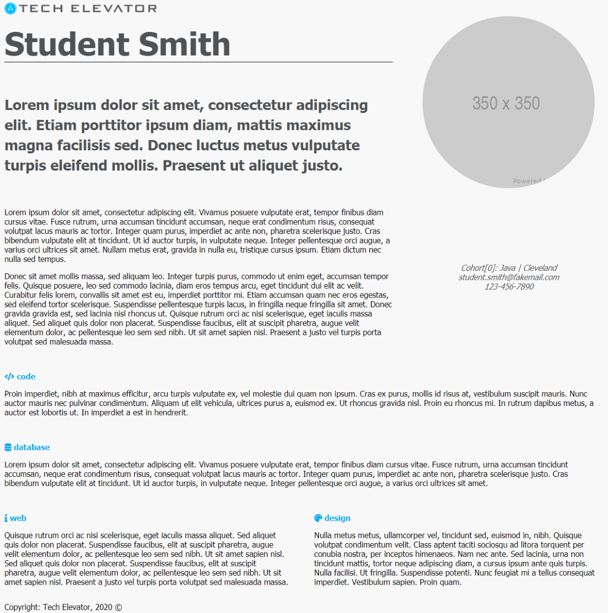
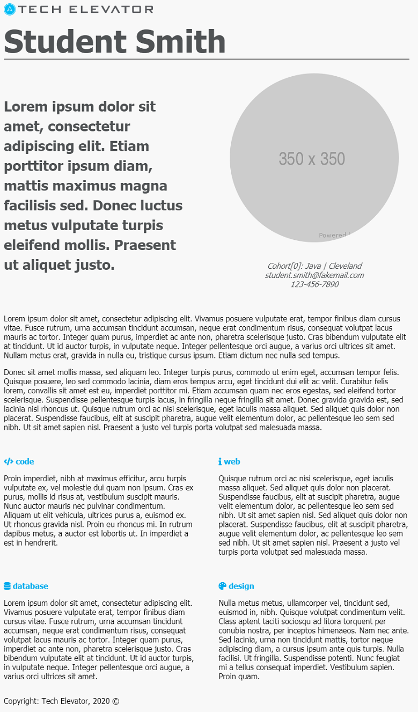

# CSS Grid Exercise

In this exercise, you'll take the existing HTML in `index.html`, and write CSS in `style.css` to create three different grid layouts that reproduce the example images below.

The three layouts are treated as a desktop layout (greater than 1024px), "small" desktop/tablet layout (less than or equal to 1024px), and a phone layout (less than or equal to 450px):

**Layout 1** - Desktop:

**Layout 2** - Tablet:

**Layout 3** - Phone:

You'll use CSS media queries to create these three layouts in a responsive manner. You shouldn't have to modify any of the existing HTML to complete this exercise.

You don't need to run this exercise on a local server to load it. Dragging and dropping the HTML file into your browser of choice is acceptable. Your browser still loads the CSS and other resources as usual.

## Before you begin

Take a moment to explore the HTML file and its structure. Take note of the `<main>`, `<h1>` and `
` blocks, and how the content in each block is displayed in the different layouts.

Also, look at the existing CSS in `style.css` that was set up for you. Colors and other styling has already been set up for you. You're only responsible for setting up the CSS grids in this exercise.

## Step One: Identify grid areas

Before starting on any of the grid layouts, the grid areas need to be defined in the CSS.

You'll need to define two grid container elements that can be located using their `id` attributes: `main-grid` and `experience-grid`. Note how `experience-grid` is a child element of `main-grid`.

The direct descendent elements of the container are the _grid items_. Look at the HTML and identify the _grid items_ that make up each grid. In your CSS file, create a selector for each _grid item_ and create a reasonable `grid-area` name for each.

## Step Two: Create the desktop layout

Now that the grid areas have been defined, you can create and style the grids.

First, create a selector for `main-grid`. Set the `display` property to `grid`, with three evenly sized columns, a row gap of 20px, and a column gap of 50px.

Next, in your selector for `experience-grid` that you created in the last step, add rules to set the `display` property to `grid`, with two evenly sized columns, a row gap of 20px, and a column gap of 50px.

Then define the `grid-template-areas` for each grid. Refer to the "Layout 1 - Desktop" image for defining the grids. Note how `student-picture` is on the same rows as the `headline` and `student-quote`, and how `student-contact` is on the same row as `student-profile`.

If you load your page in the browser, you might notice that some of the grid items don't look positioned exactly like the "Layout 1 - Desktop" image. In the selectors for `main-grid`, set `align-items` to `center` to center the content for all grid items vertically. For `student-picture` and `student-contact`, set `text-align` to `center` to center the content horizontally in those blocks.

Now your page should look like the "Layout 1 - Desktop" image.

## Step Three: Create the tablet layout

After the rules that you set up in steps one and two, create a media query with a `max-width` of 1024px. In this media query, add selectors for `main-grid` and `experience-grid`.

For `main-grid`, set the column gap to 35px, and change the columns to two evenly sized columns. Redefine `grid-template-areas` to match the "Layout 2 - Tablet" image.

For `experience-grid`, set both the row and column gaps to 20px, and redefine `grid-template-areas` to match the "Layout 2 - Tablet" image.

In your browser, if you resize the window or use the dev tools, you can test your new tablet layout. Your page should look like the "Layout 2 - Tablet" image.

## Step Four: Create the phone layout

Beneath the media query you created in step three, add another one with a `max-width` of 450px. In this media query, add selectors for `main-grid` and `experience-grid` again.

Set both grids to be one column wide, and redefine the `grid-template-areas` to match the "Layout 3 - Phone" image.

In your browser, if you resize the window or use the dev tools, you can test your new phone layout. Your page should look like the "Layout 3 - Phone" image. You may have to refresh your browser to see the changes.
